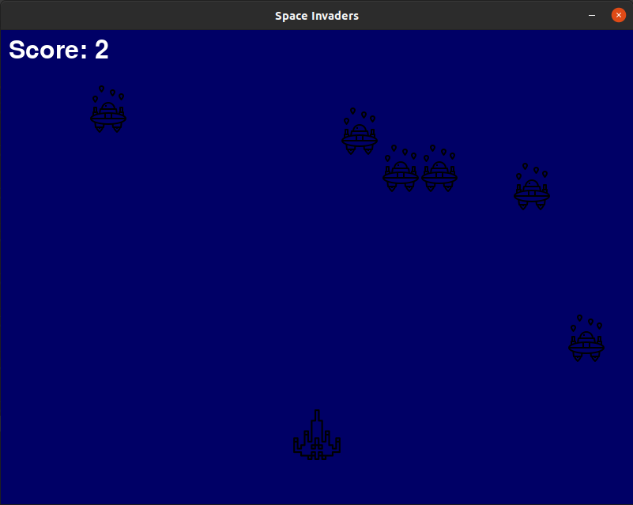

# Space Invaders

This is a simple game created using Python and PyGame, inspired by the
1970's arcade game of the same name.

## How to Play

Lauch using `python main.py`.
Move left/right using the arrow keys.
Shoot using the spacebar.

## Attributions
Icons/sprites by:
- https://www.flaticon.com/authors/nhor-phai
- https://www.flaticon.com/authors/smachicons
- https://www.flaticon.com/authors/payungkead